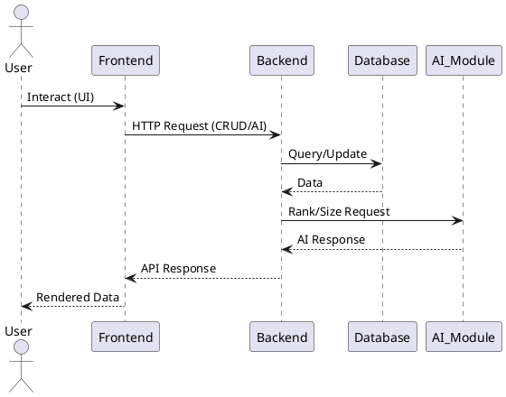

# Architecture Document: Agile TaskIQ

## 1. Overview
Agile TaskIQ is a full-stack AI-driven task management system designed for agile teams and consulting firms. The system leverages FastAPI for the backend, React for the frontend, and SQLite for persistent storage.

## 2. System Architecture Diagrams

### Component Diagram (PlantUML)
```plantuml
@startuml
actor User
User --> Frontend : uses
Frontend --> Backend : REST API calls
Backend --> Database : SQL queries
Backend --> AI_Module : /ai/rank, /ai/size
note right of AI_Module : Rule-based logic
Database : SQLite
Frontend : React
Backend : FastAPI
AI_Module : Python
@enduml
```

### Sequence Diagram (PlantUML)


## 3. Technology Stack
- Frontend: React (JavaScript)
- Backend: FastAPI (Python)
- Database: SQLite (MVP)
- ORM: SQLAlchemy
- API: RESTful
- Containerization: Docker (optional)

## 4. Component Overview

### Frontend (React + Tailwind CSS)
**Authentication & User Management:**
- `AuthPage.js`: Authentication wrapper component
- `SignIn.js`: User login with email/password
- `Register.js`: New user registration
- `ProtectedRoute.js`: Route protection wrapper
- `UserProfileSettings.js`: Profile management
- `AuthContext.js`: Global authentication state management

**Task Management:**
- `TaskList.js`: Displays all tasks with sorting/filtering
- `TaskCard.js`: Individual task display component
- `TaskDetailsPanel.js`: Detailed task view and editing
- `CreateTaskDialog.js`: Modal for creating new tasks
- `TaskDependencyGraph.js`: Visual dependency relationships

**Navigation & Layout:**
- `Sidebar.js`: Main navigation sidebar
- `TopBar.js`: Top navigation bar
- `SystemStatus.js`: Backend health indicator

**UI Components:**
- Reusable components from shadcn/ui library
- Button, Dialog, Input, Select, Slider, Switch, etc.

### Backend (FastAPI)
**Core Application:**
- `main.py`: FastAPI application setup, router configuration, CORS middleware
- `database.py`: SQLAlchemy engine, session management, Base model
- `models.py`: ORM models (User, Task, TaskDependency, etc.)
- `schemas.py`: Pydantic validation schemas for request/response

**Authentication & Authorization:**
- `auth.py`: JWT token creation/validation, password hashing, user authentication
- `users.py`: User endpoints (register, login, profile management)

**Task Management:**
- `tasks.py`: Task CRUD endpoints with JWT protection
- `task_dependencies.py`: Task dependency management
- `crud.py`: Database CRUD operations

**AI Features:**
- `ai.py`: AI endpoints (`/api/ai/rank`, `/api/ai/size`)
- `priority_scores.py`: Priority calculation algorithm
- `tshirt_scores.py`: T-shirt size estimation logic

### Testing Infrastructure
- `conftest.py`: Pytest fixtures, test database setup
- `test_tasks.py`: Task endpoint tests
- `test_ai.py`: AI endpoint tests (94 passing tests total)
- `test_crud.py`: CRUD operation tests
- `test_database.py`: Database integrity tests
- `test_integration.py`: End-to-end tests
- `test_task_dependencies.py`: Dependency tests

### Database (SQLite)
**Tables:**
- `users`: User accounts and authentication
- `tasks`: Task records with all attributes
- `task_dependencies`: Task relationship graph
- `task_priority_scores`: AI-calculated priorities
- `task_tshirt_scores`: AI complexity estimates

**Features:**
- Foreign key constraints with CASCADE deletes
- CHECK constraints for enum fields (status, tshirt_size)
- Automatic timestamps (created_at, updated_at)
- Referential integrity enforced

## 4.1 API Endpoint Summary

### Authentication Endpoints
| Endpoint              | Method | Description                        |
|-----------------------|--------|------------------------------------|
| /api/auth/register    | POST   | Register a new user                |
| /api/auth/login       | POST   | Login with OAuth2 form             |
| /api/auth/login-json  | POST   | Login with JSON payload            |
| /api/auth/me          | GET    | Get current user information       |
| /api/auth/change-password | PUT | Change user password            |
| /api/auth/profile     | PUT    | Update user profile                |

### Task Management Endpoints
| Endpoint              | Method | Description                        |
|-----------------------|--------|------------------------------------|
| /api/tasks            | GET    | Get all tasks (filtered by user)   |
| /api/tasks/{id}       | GET    | Get a specific task                |
| /api/tasks            | POST   | Create a new task                  |
| /api/tasks/{id}       | PUT    | Update a task                      |
| /api/tasks/{id}       | DELETE | Delete a task                      |

### AI Endpoints
| Endpoint                    | Method | Description                              |
|-----------------------------|--------|------------------------------------------|
| /api/ai/rank                | POST   | Batch priority scoring for multiple tasks|
| /api/ai/size                | POST   | T-shirt size estimation for task data    |
| /api/tasks/{id}/ai/size     | GET    | Get t-shirt size estimate for a task     |
| /api/tasks/{id}/ai/priority | GET    | Get priority score for a task            |

### Task Dependency Endpoints
| Endpoint                     | Method | Description                          |
|------------------------------|--------|--------------------------------------|
| /api/tasks/{id}/dependencies | GET    | Get all dependencies for a task      |
| /api/tasks/{id}/dependencies | POST   | Add a dependency to a task           |
| /api/dependencies/{id}       | DELETE | Remove a specific dependency         |

### User Management Endpoints
| Endpoint         | Method | Description                        |
|------------------|--------|------------------------------------|
| /api/users       | GET    | Get all users (protected)          |
| /api/users/{id}  | GET    | Get a specific user                |
| /api/users       | POST   | Create a new user                  |
| /api/users/{id}  | PUT    | Update a user                      |
| /api/users/{id}  | DELETE | Delete a user                      |

### Health & Documentation
| Endpoint    | Method | Description                        |
|-------------|--------|------------------------------------|
| /health     | GET    | Health check endpoint              |
| /docs       | GET    | Swagger UI API documentation       |
| /redoc      | GET    | ReDoc API documentation            |

## 5. Data Flow
1. User interacts with React UI
2. React sends HTTP requests to FastAPI endpoints
3. FastAPI processes requests, interacts with database, returns responses
4. AI endpoints provide task ranking and T-shirt size recommendations

## 6. Database Schema
The finalized schema is available at `backend/schema.sql` and the seeded SQLite database is `backend/database.db`.

Short summary of tables (see `backend/schema.sql` for full DDL):
- `users` (id, name, email, password_hash, created_at)
- `tasks` (id, user_id → users.id, title, description, deadline, estimated_duration, status, created_at, updated_at)
- `task_dependencies` (id, task_id → tasks.id, depends_on_task_id → tasks.id)
- `task_priority_scores` (id, task_id → tasks.id, score)
- `task_tshirt_scores` (id, task_id → tasks.id, tshirt_size, rationale)

Foreign keys and constraints are enforced in the DDL (ON DELETE CASCADE and CHECK constraints for status/size fields).

## 7. Security Considerations
- **Authentication**: JWT-based authentication with bcrypt password hashing
- **SECRET_KEY**: Configurable via environment variable (default provided for development)
- **CORS**: Enabled for frontend-backend integration
- **Input Validation**: Comprehensive validation via Pydantic models
- **SQL Injection Protection**: SQLAlchemy ORM prevents SQL injection attacks
- **Database Constraints**: Foreign keys with CASCADE delete, CHECK constraints enforced
- **Security Review**: Comprehensive security audit available in `docs/SECURITY_REVIEW.md`
  - 11 findings documented with severity levels
  - Remediation guidance provided
  - Production deployment recommendations included

## 8. Scalability & Future Enhancements
- Modular backend for easy feature expansion
- Database can be migrated to PostgreSQL/MySQL in future
- AI logic can be upgraded to ML-based models

## 9. Testing Suite

### Backend Testing (pytest)
**Test Coverage: 94 passing tests**

**Test Files:**
- `test_tasks.py`: Task CRUD operations, filtering, status updates
- `test_ai.py`: AI priority scoring and t-shirt sizing (7 detailed scenarios)
- `test_crud.py`: Database CRUD operations
- `test_database.py`: Foreign key constraints, referential integrity
- `test_integration.py`: End-to-end user journeys
- `test_task_dependencies.py`: Dependency management

**Test Infrastructure:**
- In-memory SQLite database for isolated tests
- Fixtures for users, tasks, and test data
- FastAPI TestClient for API testing
- Comprehensive edge case coverage

**Running Tests:**
```bash
# Run all tests
pytest backend/tests -v

# Run specific test file
pytest backend/tests/test_ai.py -v

# Run with coverage
pytest backend/tests --cov=app
```

### Frontend Testing (Jest + React Testing Library)
**Test Files:**
- `Dashboard.test.jsx`: Dashboard component tests
- `TaskForm.test.jsx`: Task creation/editing tests
- `TaskList.test.jsx`: Task list display and interaction tests

**Running Tests:**
```bash
cd frontend
npm test
```

### Test Documentation
- Detailed test suite documentation: `docs/TEST_SUITE_OVERVIEW.md`
- Security testing results: `docs/SECURITY_REVIEW.md`

## 10. Project Directory Structure (Actual)
```bash
220372-AG-AISOFTDEV-Team-4-SynapseSquad/
├── backend/
│   ├── app/
│   │   ├── main.py              # FastAPI entrypoint with router configuration
│   │   ├── models.py            # SQLAlchemy ORM models
│   │   ├── schemas.py           # Pydantic validation schemas
│   │   ├── database.py          # DB connection and session management
│   │   ├── auth.py              # JWT authentication and password hashing
│   │   ├── crud.py              # CRUD operations
│   │   ├── tasks.py             # Task endpoints (router)
│   │   ├── users.py             # User/auth endpoints (router)
│   │   ├── ai.py                # AI endpoints: /ai/rank, /ai/size
│   │   ├── task_dependencies.py # Task dependency endpoints
│   │   ├── priority_scores.py   # Priority scoring logic
│   │   └── tshirt_scores.py     # T-shirt sizing logic
│   ├── tests/
│   │   ├── conftest.py          # Pytest fixtures and test configuration
│   │   ├── test_tasks.py        # Task endpoint tests
│   │   ├── test_ai.py           # AI endpoint tests
│   │   ├── test_crud.py         # CRUD operation tests
│   │   ├── test_database.py     # Database integrity tests
│   │   ├── test_integration.py  # End-to-end integration tests
│   │   └── test_task_dependencies.py # Dependency tests
│   ├── schema.sql               # Database DDL
│   ├── seed_data.sql            # Initial data for demo
│   ├── database.db          # SQLite database file
│   ├── main.py                  # Entrypoint for uvicorn
│   ├── Dockerfile               # Production Docker image
│   ├── Dockerfile.dev           # Development Docker image
│   ├── README.md                # Backend documentation
│   └── PLAN.md                  # Development plan
│
├── frontend/
│   ├── src/
│   │   ├── App.js               # Main React component
│   │   ├── index.js             # React entry point
│   │   ├── components/
│   │   │   ├── AuthPage.js      # Authentication wrapper
│   │   │   ├── SignIn.js        # Login component
│   │   │   ├── Register.js      # Registration component
│   │   │   ├── TaskList.js      # Task list display
│   │   │   ├── TaskCard.js      # Individual task card
│   │   │   ├── TaskDetailsPanel.js # Task details sidebar
│   │   │   ├── CreateTaskDialog.js # Task creation modal
│   │   │   ├── TaskDependencyGraph.js # Dependency visualization
│   │   │   ├── Sidebar.js       # Navigation sidebar
│   │   │   ├── TopBar.js        # Top navigation
│   │   │   ├── SystemStatus.js  # System health indicator
│   │   │   ├── UserProfileSettings.js # Profile management
│   │   │   ├── ProtectedRoute.js # Auth route wrapper
│   │   │   └── ui/              # Reusable UI components (shadcn)
│   │   │       ├── button.js, dialog.js, input.js, etc.
│   │   ├── contexts/
│   │   │   └── AuthContext.js   # Authentication state management
│   │   ├── __tests__/           # Frontend tests
│   │   │   ├── Dashboard.test.jsx
│   │   │   ├── TaskForm.test.jsx
│   │   │   └── TaskList.test.jsx
│   │   └── App.css, index.css   # Styling
│   ├── public/
│   │   ├── index.html
│   │   └── favicon.ico, manifest.json
│   ├── package.json             # Dependencies
│   ├── tailwind.config.js       # Tailwind CSS configuration
│   ├── craco.config.js          # Create React App configuration
│   ├── Dockerfile, Dockerfile.dev, Dockerfile.prod
│   └── README.md                # Frontend documentation
│
├── docs/
│   ├── PRD.md                   # Product Requirements Document (470+ lines)
│   ├── PRD_AI_DRAFT.md          # Original AI-generated PRD
│   ├── ARCHITECTURE.md          # This document - system architecture
│   ├── ADR.md                   # Architecture Decision Records
│   ├── SECURITY_REVIEW.md       # Security vulnerabilities report
│   ├── AGILE_PLAN.md            # Sprint/task planning
│   ├── SETUP.md                 # Environment setup guide
│   ├── ENV_FORMAT.md            # Environment variables reference
│   ├── DOCKER_README.md         # Docker usage guide
│   ├── CICD_PIPELINE.md         # CI/CD documentation
│   ├── TEST_SUITE_OVERVIEW.md   # Testing documentation
│   └── ui/                      # Wireframes and mockups
│       ├── DRAFT_UI.png
│       ├── WIREFRAME_1.png, 2, 3, 4.png
│
├── artifacts/
│   ├── PRD_Generator/           # CrewAI agent system for PRD generation
│   │   ├── agents_custom.py     # Multi-agent system implementation
│   │   ├── demos/
│   │   │   ├── demo_notebook.ipynb # Jupyter demo
│   │   │   └── test_agent.py    # Testing script
│   │   ├── frontend/            # Web UI for PRD generator
│   │   ├── templates/
│   │   │   └── prd_template.md  # PRD template
│   │   ├── requirements.txt
│   │   └── README.md
│   └── figma/                   # Figma-to-React components
│       ├── src/
│       │   ├── App.tsx          # Generated React app
│       │   └── components/      # Generated components
│       ├── package.json
│       └── README.md
│
├── docker-compose.yml           # Production Docker Compose
├── docker-compose.dev.yml       # Development Docker Compose
├── docker-compose.test.yml      # Test Docker Compose
├── docker-start.ps1, docker-start.sh # Docker startup scripts
├── docker-rebuild.ps1           # Docker rebuild script
├── DOCKER_START_GUIDE.md        # Docker quick start
├── DOCUMENTATION_INDEX.md       # Index of all documentation
├── INTEGRATION_GUIDE.md         # Integration documentation
├── CAPSTONE_CHECKLIST.md        # Capstone requirements checklist
├── DEMO_DAY_README.md           # Demo day playbook
├── README.md                    # Main project README (557 lines)
└── requirements.txt             # Python dependencies
```

## 11. Cross-References
- [Product Requirements Document (PRD)](./PRD.md)
- [Architecture Decision Records (ADR)](./ADR.md)
- [Agile Plan](./AGILE_PLAN.md)
- [Security Review Report](./SECURITY_REVIEW.md)
- [Environment Variables Reference](./ENV_FORMAT.md)
- [Test Suite Overview](./TEST_SUITE_OVERVIEW.md)
- [Main Project README](../README.md)

## 12. Deployment & Operations
- **Development**: Use `uvicorn main:app --reload` for backend, `npm start` for frontend
- **Docker**: Use `docker-compose up` for containerized deployment
- **Testing**: Run `pytest backend/tests` for backend tests
- **Documentation**: All documentation centralized in `/docs` directory

## Appendix
- Database schema is finalized in `backend/schema.sql`
- Seeded database available at `backend/database.db`
- API documentation available via Swagger UI at `/docs` when backend is running
