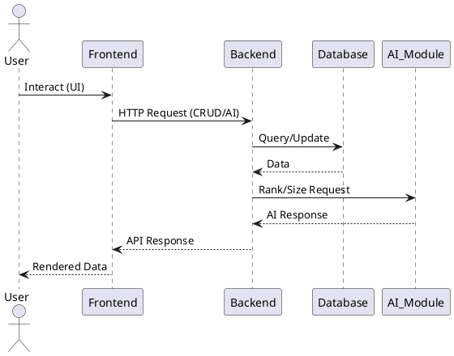

# Architecture Document: Agile TaskIQ

## 1. Overview
Agile TaskIQ is a full-stack AI-driven task management system designed for agile teams and consulting firms. The system leverages FastAPI for the backend, React for the frontend, and SQLite for persistent storage.

## 2. System Architecture Diagrams

### Component Diagram (PlantUML)
```plantuml
@startuml
actor User
User --> Frontend : uses
Frontend --> Backend : REST API calls
Backend --> Database : SQL queries
Backend --> AI_Module : /ai/rank, /ai/size
note right of AI_Module : Rule-based logic
Database : SQLite
Frontend : React
Backend : FastAPI
AI_Module : Python
@enduml
```

### Sequence Diagram (PlantUML)


## 3. Technology Stack
- Frontend: React (JavaScript)
- Backend: FastAPI (Python)
- Database: SQLite (MVP)
- ORM: SQLAlchemy
- API: RESTful
- Containerization: Docker (optional)

## 4. Component Overview
- **Frontend (React):**
	- TaskList: Displays all tasks
	- TaskForm: Create/edit tasks
	- SizeRecommendationForm: T-shirt size feature
	- Dashboard: Priority overview
	- API Integration: Axios for REST calls
- **Backend (FastAPI):**
	- main.py: Entrypoint, app setup
	- models.py: SQLAlchemy models
	- schemas.py: Pydantic schemas
	- crud.py: CRUD logic
	- api/tasks.py: Task endpoints
	- api/ai.py: AI endpoints (/ai/rank, /ai/size)
	- database.py: DB connection/session
- **AI Module:**
	- Rule-based logic for priority and size
- **Database (SQLite):**
	- Tables: users, tasks, task_dependencies, task_priority_scores, task_tshirt_scores
	- [Details to be updated after schema.sql is finalized]

## 4.1 API Endpoint Summary

| Endpoint           | Method | Description                        |
|--------------------|--------|------------------------------------|
| /tasks             | GET    | Get all tasks                      |
| /tasks             | POST   | Create a new task                  |
| /tasks/{id}        | PUT    | Update a task                      |
| /tasks/{id}        | DELETE | Delete a task                      |
| /ai/rank           | POST   | Get priority scores for tasks      |
| /ai/size           | POST   | Get T-shirt size recommendation    |

## 5. Data Flow
1. User interacts with React UI
2. React sends HTTP requests to FastAPI endpoints
3. FastAPI processes requests, interacts with database, returns responses
4. AI endpoints provide task ranking and T-shirt size recommendations

## 6. Database Schema
The finalized schema is available at `backend/schema.sql` and the seeded SQLite database is `backend/team_synapse.db`.

Short summary of tables (see `backend/schema.sql` for full DDL):
- `users` (id, name, email, password_hash, created_at)
- `tasks` (id, user_id → users.id, title, description, deadline, estimated_duration, status, created_at, updated_at)
- `task_dependencies` (id, task_id → tasks.id, depends_on_task_id → tasks.id)
- `task_priority_scores` (id, task_id → tasks.id, score)
- `task_tshirt_scores` (id, task_id → tasks.id, tshirt_size, rationale)

Foreign keys and constraints are enforced in the DDL (ON DELETE CASCADE and CHECK constraints for status/size fields).

## 7. Security Considerations
- CORS enabled for frontend-backend integration
- Input validation via Pydantic models
- Security audit/report will be maintained (see PRD Section 13)
- [Additional security details to be updated after schema.sql is ready]

## 8. Scalability & Future Enhancements
- Modular backend for easy feature expansion
- Database can be migrated to PostgreSQL/MySQL in future
- AI logic can be upgraded to ML-based models

## 9. Testing Suite
- Backend: pytest for API/unit tests
- Frontend: (planned) Jest/React Testing Library
- See AGILE_PLAN.md for testing tasks and responsibilities

## 10. Project Directory Structure (MVP)
```bash
task-manager/
├── backend/
│   ├── app/
│   │   ├── main.py              # FastAPI entrypoint
│   │   ├── models.py            # SQLAlchemy models
│   │   ├── schemas.py           # Pydantic schemas
│   │   ├── crud.py              # CRUD operations
│   │   ├── api/
│   │   │   ├── tasks.py         # Task endpoints
│   │   │   ├── ai.py            # AI endpoints (/rank, /size)
│   │   │   └── dependencies.py  # Dependency endpoints
│   │   └── database.py          # DB connection / session
│   ├── requirements.txt
│   └── alembic/                 # Optional for migrations
│
├── frontend/
│   ├── src/
│   │   ├── App.js
│   │   ├── components/
│   │   │   ├── TaskList.jsx
│   │   │   ├── TaskForm.jsx
│   │   │   └── Dashboard.jsx
│   │   ├── api/
│   │   │   └── index.js         # Axios API calls
│   │   └── utils/
│   └── package.json
│
├── README.md
└── .env                         # Environment variables
```

## 11. Cross-References
- [Product Requirements Document (PRD)](./PRD.md)
- [Architecture Decision Records (ADR)](./ADR.md)
- [Agile Plan](./AGILE_PLAN.md)
- [Security Audit Report](./SECURITY.md) (to be created)


## Appendix
- This document will be updated with ER diagrams and detailed schema once schema.sql is available.
